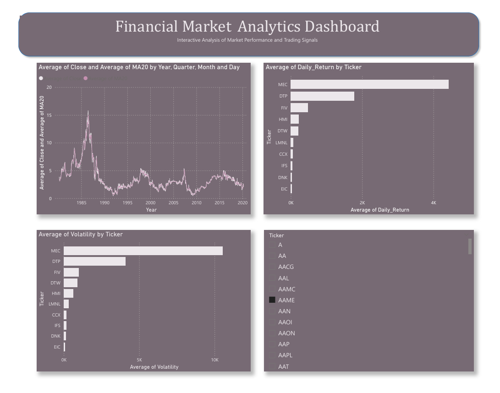

# Financial Market Analytics Dashboard

A comprehensive analytics platform for stock market data analysis, featuring data processing pipelines, technical indicators, and interactive Power BI visualizations.



## 📊 Overview

This project provides end-to-end stock market analytics capabilities, from raw data collection to advanced technical analysis and interactive dashboard visualization. It processes historical stock data, calculates key technical indicators, and identifies trading opportunities through systematic analysis.

## ⚠️ Important: Data Restoration Required

**Your original CSV data files were accidentally deleted.** To restore your project functionality:

1. **Read the restoration guide**: See [`RESTORE_DATA.md`](RESTORE_DATA.md) for detailed instructions
2. **Install dependencies**: `pip install -r requirements.txt`
3. **Download sample data**: `python scripts/download_sample_data.py`
4. **Run the processing pipeline** as described below

## 🚀 Features

### Data Processing Pipeline
- **Data Collection**: Automated combination of multiple stock CSV files into a unified dataset
- **Data Cleaning**: Comprehensive data preprocessing including missing value handling, duplicate removal, and date formatting
- **Feature Engineering**: Calculation of essential technical indicators

### Technical Indicators
- **Daily Returns**: Percentage price changes for performance analysis
- **Moving Averages**: 20-day simple moving averages for trend identification
- **Volatility**: 20-day rolling standard deviation of returns
- **RSI (Relative Strength Index)**: 14-day momentum oscillator for overbought/oversold conditions

### Analytics Capabilities
- **Top Performing Stocks**: Identification of highest average daily return stocks
- **Volatility Analysis**: Ranking of most volatile stocks for risk assessment
- **Market Signals**: Detection of overbought (RSI > 70) and oversold (RSI < 30) conditions
- **SQL Queries**: Structured query interface for advanced analysis

### Interactive Dashboard
- **Power BI Visualization**: Interactive dashboard for exploring analytics results
- **Real-time Insights**: Dynamic charts and graphs for market analysis
- **Export Capabilities**: CSV exports for further analysis

## 🛠️ Technology Stack

- **Programming Language**: Python 3.x
- **Data Processing**: Pandas, NumPy
- **Visualization**: Power BI Desktop
- **Database Queries**: SQL
- **Data Validation**: Jupyter Notebooks

## 📁 Project Structure

```
financial-market-analytics-dashboard/
│
├── dashboard/
│   └── financial_market_dashboard.pbix    # Power BI interactive dashboard
│
├── data/
│   ├── raw_stock_data.csv                 # Combined raw stock data
│   ├── cleaned_stock_data.csv             # Preprocessed data
│   ├── engineered_stock_data.csv          # Data with technical indicators
│   ├── top10_returns.csv                  # Top performing stocks
│   ├── top10_volatility.csv               # Most volatile stocks
│   ├── overbought_stocks.csv              # Overbought signals (RSI > 70)
│   └── oversold_stocks.csv                # Oversold signals (RSI < 30)
│
├── dataset/
│   ├── symbols_valid_meta.csv             # Stock symbols metadata
│   ├── etfs/                              # ETF historical data (CSV files)
│   └── stocks/                            # Individual stock data (CSV files)
│
├── notebooks/
│   └── data_validation.ipynb              # Data quality validation notebook
│
├── scripts/
│   ├── combine_stocks.py                  # Data aggregation script
│   ├── data_cleaning.py                   # Data preprocessing pipeline
│   ├── feature_engineering.py             # Technical indicator calculations
│   └── analytics.py                       # Main analytics engine
│
├── sql/
│   └── analysis_queries.sql               # SQL analysis queries
│
└── README.md                              # Project documentation
```

## 🔧 Installation & Setup

### Prerequisites
- Python 3.8 or higher
- Power BI Desktop (for dashboard visualization)
- Git (for version control)

### Installation Steps

1. **Clone the repository**
   ```bash
   git clone https://github.com/yourusername/financial-market-analytics-dashboard.git
   cd financial-market-analytics-dashboard
   ```

2. **Install Python dependencies**
   ```bash
   pip install -r requirements.txt
   ```

3. **Restore or download data**
   ```bash
   # Option 1: Download sample data (recommended for testing)
   python scripts/download_sample_data.py

   # Option 2: Restore your original CSV files to dataset/stocks/ and dataset/etfs/
   # See RESTORE_DATA.md for detailed instructions
   ```

4. **Run the data processing pipeline**
   ```bash
   python scripts/combine_stocks.py
   python scripts/data_cleaning.py
   python scripts/feature_engineering.py
   python scripts/analytics.py
   ```

## 🚀 Usage

### Data Processing Pipeline

1. **Combine stock data**
   ```bash
   python scripts/combine_stocks.py
   ```

2. **Clean the data**
   ```bash
   python scripts/data_cleaning.py
   ```

3. **Generate technical indicators**
   ```bash
   python scripts/feature_engineering.py
   ```

4. **Run analytics**
   ```bash
   python scripts/analytics.py
   ```

### Data Validation

Open the Jupyter notebook for data quality checks:
```bash
jupyter notebook notebooks/data_validation.ipynb
```

### Dashboard Visualization

1. Open `dashboard/financial_market_dashboard.pbix` in Power BI Desktop
2. Connect to the generated CSV files in the `data/` directory
3. Interact with the dashboard to explore insights

### SQL Analysis

Use the provided SQL queries in `sql/analysis_queries.sql` with your preferred SQL client or database system.

## 📈 Analytics Output

The analytics pipeline generates several key outputs:

- **Top 10 Returns**: Stocks with highest average daily returns
- **Top 10 Volatility**: Most volatile stocks (highest risk)
- **Overbought Signals**: Stocks with RSI > 70 (potential sell signals)
- **Oversold Signals**: Stocks with RSI < 30 (potential buy signals)

## 🔍 Data Sources

- Individual stock data files in `dataset/stocks/`
- ETF data files in `dataset/etfs/`
- Stock symbols metadata in `dataset/symbols_valid_meta.csv`

*Note: Ensure your CSV files follow the expected format with OHLCV (Open, High, Low, Close, Volume) data*

## 🤝 Contributing

1. Fork the repository
2. Create a feature branch (`git checkout -b feature/AmazingFeature`)
3. Commit your changes (`git commit -m 'Add some AmazingFeature'`)
4. Push to the branch (`git push origin feature/AmazingFeature`)
5. Open a Pull Request

## 📝 License

This project is licensed under the MIT License - see the [LICENSE](LICENSE) file for details.

## 📧 Contact

For questions or support, please open an issue on GitHub.

## 🙏 Acknowledgments

- Thanks to the open-source community for the amazing tools and libraries
- Special thanks to financial data providers for making market data accessible

---

*Built with ❤️ for financial market analysis and education*
